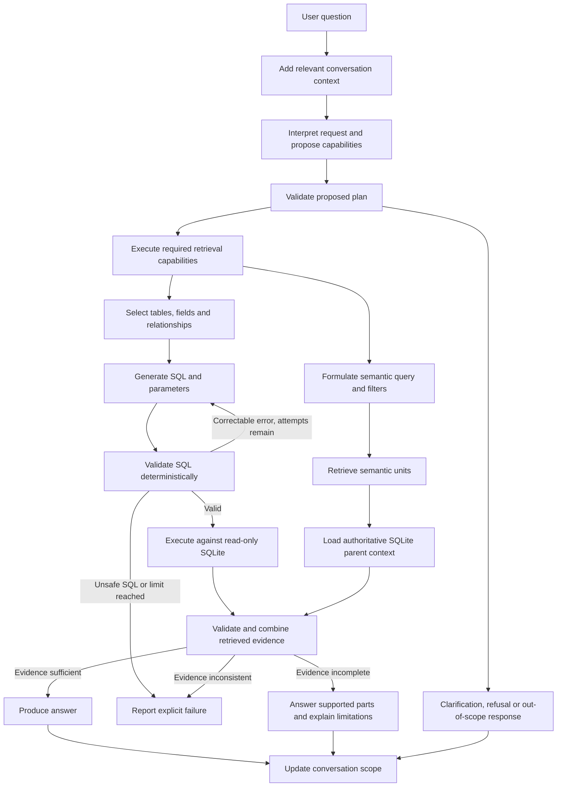

# Architecture and Learning Objectives

## Project objectives

This project has two equally important objectives:

1. Build a credible, production-minded agentic analytics system over job-application data.
2. Use that system as a hands-on learning vehicle for modern agentic AI engineering.

Optimise for sound engineering and visibility into how the technologies work. The implementation should make decisions understandable, explainable and comparable through traces and experiments.

This document describes the intended architecture, not implemented functionality. Retrieval, data semantics and indexing remain authoritative in their respective contracts.

## Learning objectives

The two primary learning goals are **LangGraph / LangSmith** and **SLMs / open-weight / closed-weight models**. They are equally important. Retrieval, agent architecture, LLMOps and production engineering support these goals.

Model size, access to weights and deployment location are independent dimensions. Open-weight models may be large or hosted; closed-weight models may be small. Keep these dimensions explicit in experiment configuration and comparisons.

| Area | Practical experience |
|---|---|
| LangGraph | State management, nodes, edges, conditional execution, parallel branches, loops, retries, tools, checkpointing, conversational state and human-in-the-loop where relevant |
| LangSmith | Tracing, datasets, evaluators, experiments, regression evaluation, prompt/model comparison, latency and token analysis |
| Semantic retrieval / RAG | Unit modelling, chunking, embeddings, vector search, metadata filters, aggregation to jobs, retrieval evaluation, stale indexes and re-indexing |
| SLMs, open-weight and closed-weight models | Local and hosted inference, structured outputs, bounded tasks, capability differences, quality/latency/cost trade-offs and stronger-model fallback |
| Agent architecture | Planning, tool selection, capability composition, evidence merging, grounded synthesis and separating deterministic logic from probabilistic reasoning |
| LLMOps | Model/prompt versions, token usage, latency, failures, retries, fallback rates and regression tests |
| Production engineering | Service boundaries, adapters, idempotency, versioned derived data, read-only safeguards, testability and migration to managed services |

Use these concepts when a real application requirement makes them useful. Do not add loops, parallelism or human approval solely to showcase a feature.

## Orchestration and state

Use LangGraph directly. Keep nodes small and testable, with explicit state transitions and dependencies.

State should make the request and inherited conversation scope, selected capabilities, tool inputs/results, source identifiers, evidence, failures, retry/fallback attempts and final answer inspectable. Choose an explicit persistence/checkpointing strategy when implementing conversational state.

The planner composes structured query, semantic retrieval and synthesis. There is no mandatory fixed structured/semantic/hybrid graph path. Independent retrieval may run in parallel; dependent operations run sequentially. Validate model-produced plans and structured outputs before tool execution.

SQL handles deterministic facts, filtering, joins, ranking and aggregation. Models handle interpretation, conceptual query formulation and grounded synthesis. Neither planning nor fallback may bypass deterministic safety checks.

See [retrieval_contract.md](retrieval_contract.md) for runtime behaviour, including conversational follow-ups, clarification, refusal and evidence discipline.

### Request flow

The flow below records the design agreed during [#14 — ModelProvider and initial experiment plan](https://github.com/danielBrule/agentic-job-analytics/issues/14). It starts with the user question; snapshot pinning is an execution invariant, not a model task. The diagram shows responsibilities rather than requiring one node or model invocation per box.



A request uses structured retrieval, semantic retrieval or both. The two edges from retrieval are available capabilities, not mandatory parallel execution: SQL may first supply a constrained set for semantic search, or semantic hits may require SQL enrichment. Pin one published generation before data access; no available generation produces an explicit data-unavailable response. Failures remain inspectable in state and traces.

For the initial small schema, schema selection and SQL generation share one model invocation but return separate inspectable outputs: selected tables/fields/joins and a brief decision rationale, followed by SQL and bound parameters. Supply the documented schema and field meanings; validate selected identifiers and relationships as well as the statement. Do not request hidden reasoning. Compare separate schema-selection and SQL-generation calls as a later controlled experiment; an extra call adds overhead and can exclude necessary schema prematurely.

SQL validation and read-only execution are separate deterministic steps. A syntax or schema error can prompt bounded correction; attempted writes or other safety violations fail without execution or escalation. An empty result is not a failure. Exact results can be formatted without synthesis; qualitative conclusions require grounded synthesis. Inconsistent evidence is a failure, while genuinely missing evidence warrants a limitation. No unbounded autonomous retrieval loop is required initially.

### Bounded model tasks

| Task | Required output | Responsibilities outside the model |
|---|---|---|
| `planner` | Structured capability plan, constraints, dependencies or clarification/refusal/out-of-scope disposition | Plan validation, permitted tools, execution order and budgets |
| `sql_generation` | Selected schema, brief rationale, one SQL statement and parameters | Identifier checks, SQL safety validation, read-only execution and exact calculations |
| `semantic_query` | Query text and permitted field/metadata filters | Filter validation, embedding, vector search, deduplication and SQLite reconstruction |
| `synthesis` | Answer with evidence references and explicit limitations | Reference validation and preserving canonical facts; direct formatting when interpretation is unnecessary |

These task keys are independently configurable responsibilities, not separate autonomous agents. The planner never executes tools. Initially use structured plans with application-controlled execution; native model tool calling, streaming, separate schema selection and embeddings are outside the initial generative interface. Tool calling may be added when a concrete use case and evaluation justify it.

## External service boundaries

Use small ports and adapters around external infrastructure and models. Configuration selects implementations; graph nodes depend on interfaces rather than importing provider-specific clients.

| Boundary | Confirmed direction | Potential implementations or future substitutions |
|---|---|---|
| RelationalStore | SQLite initially | Postgres later |
| VectorStore | Provider not selected | Qdrant, pgvector, Pinecone or Azure AI Search |
| EmbeddingProvider | Provider/model not selected | Hosted or local embedding provider |
| ModelProvider | Providers/runtimes not selected | Hosted APIs, Ollama or vLLM |
| Observability/evaluation boundary | LangSmith | Narrow isolation where it helps testing |

Qdrant and Ollama are potential candidates, not selected defaults or dependencies. Assess the service requirements, local hardware and measured trade-offs before selecting implementations. LangGraph and LangSmith are deliberate learning choices; vector storage, local inference runtime and model selections remain open.

These are design directions, not a requirement to implement every adapter. Keep interfaces capability-oriented and introduce only methods that actual use cases need. Document capabilities that a replacement service cannot support; configuration changes alone do not guarantee backend equivalence.

Use LangGraph directly rather than wrapping it in a generic workflow framework. Use LangSmith directly enough to learn its traces, datasets and experiments. Infrastructure isolation must not hide the learning technologies.

Copilot SQLite remains the canonical upstream source. Runtime SQL and semantic retrieval use one published analytics snapshot/index generation; see [snapshot ingestion and publication](indexing.md#snapshot-ingestion-and-publication). Older but internally consistent data is acceptable, and capture time is visible. Migration to another relational service is future work and must preserve domain/retrieval contracts while explicitly validating schema and SQL compatibility.

## ModelProvider interface

The #14 deliverable is a design specification. [#28 — provider adapters and profiles](https://github.com/danielBrule/agentic-job-analytics/issues/28) implements and tests it after the [privacy boundaries in #15](https://github.com/danielBrule/agentic-job-analytics/issues/15). No provider SDK or runtime dependency is selected by this document. Existing service doubles are test infrastructure, not production interfaces.

Use one asynchronous invocation operation on a configured provider/model adapter:

```python
class ModelProvider(Protocol):
    async def invoke(self, request: ModelRequest) -> ModelResult:
        ...
```

This is a signature specification, not executable repository code. Implement typed immutable records where practical; graph nodes must not receive raw SDK objects. A capability descriptor associated with the resolved adapter identifies accepted schema/settings and context/output limits where known. Validate these before invocation; configuration flags alone do not prove service support.

| Record | Fields and semantics |
|---|---|
| `ModelRequest` | Role-tagged text messages; optional JSON output schema and schema version; effective invocation settings; per-attempt timeout. Model/credential selection is resolved before injection, not supplied by graph business logic. |
| `ModelResult` | Optional text or parsed structured content; normalized finish reason (`completed`, `refused`, `truncated`, `failed`); requested and actual provider/model identity with revision when available; nullable reported usage; optional reported cost; sanitized failure category and retry hint. A provider-completed response is not proof that application validation passed. |
| Usage | Nullable input/output/total token counts with provenance (`reported` or `derived`) and provider-defined cache/reasoning breakdowns. Derive totals only where the adapter documents compatible accounting. Never add subsets again to reported totals. |
| Cost | Decimal amount, currency, basis (`reported` or `estimated`), pricing reference/version or date, and covered components. Unknown cost is null, not zero; reported cost is not labelled billed unless the provider establishes that. |
| Attempt record | Task/profile, attempt index, invocation reason (`initial`, `retry`, `correction`, `fallback`), prompt/schema versions, effective settings, resolved identity, monotonic client elapsed seconds, provider duration separately where available, usage/cost and provider/application validation outcomes. |
| Task result | Final content or classified failure, ordered attempt records, fallback outcome, end-to-end elapsed seconds including validation/backoff, known token/cost subtotals and missing-data coverage. |

The adapter translates inputs, normalizes provider results and preserves available usage on failures. Operational failures return classified results; programming defects are not disguised as retryable provider failures. Unknown actual identity stays explicit rather than being copied from the requested model. Credentials and raw provider exceptions are never part of public result records.

An invocation coordinator outside the adapter measures client time, validates application outputs and applies bounded retry/correction/fallback. A small pricing component computes estimates from versioned rates outside graph nodes; partial usage produces a partial estimate with coverage, never a fabricated complete total. Do not sum different currencies or provider token counts as interchangeable work units. Local API charges, energy/hardware costs and hosted charges are separate components; unmeasured local operating cost remains unknown. Parallel task durations do not sum to request wall time.

## Configuration and model strategies

Configure models through a configuration file with named profiles. Each profile assigns models independently by agent or model task, such as planning, SQL generation and synthesis. A single model may fill all roles, or different roles may use different models. These names describe configurable responsibilities; they do not require separate autonomous agents.

The named-profile schema below defines the intended loader contract. Candidate model IDs, providers, endpoints and budgets are illustrative until feasibility and candidate selection are confirmed. Placeholder IDs deliberately do not form runnable configuration:

```yaml
schema_version: 1
models:
  small:
    provider: candidate_local_runtime
    model: PINNED_MODEL_ARTIFACT
    endpoint: http://localhost:11434
    weight_access: open
    deployment: local
    parameters_billions: 1.7
  strong:
    provider: candidate_hosted_api
    model: PINNED_HOSTED_MODEL_ID
    credential_env: MODEL_API_KEY
    weight_access: closed
    deployment: hosted
    parameters_billions: null  # Undisclosed, not inferred from the product name.
prompts:
  planner: {version: planner-v1}
  sql_generation: {version: sql-v1}
  semantic_query: {version: semantic-v1}
  synthesis: {version: synthesis-v1}
profiles:
  hosted_baseline:
    assignments: {planner: strong, sql_generation: strong, semantic_query: strong, synthesis: strong}
    invocation: {max_output_tokens: 2048, timeout_seconds: 60}
    execution: {max_attempts_per_task: 3, task_deadline_seconds: 180}
    retry: {max_additional_attempts: 1, categories: [timeout, rate_limit, service_unavailable], backoff_seconds: 1}
    correction: {max_additional_attempts: 1, categories: [invalid_output, sql_syntax, sql_schema]}
    fallbacks: {}
  small_with_fallback:
    assignments: {planner: small, sql_generation: small, semantic_query: small, synthesis: small}
    invocation: {max_output_tokens: 2048, timeout_seconds: 60}
    execution: {max_attempts_per_task: 3, task_deadline_seconds: 180}
    retry: {max_additional_attempts: 1, categories: [timeout, rate_limit, service_unavailable], backoff_seconds: 1}
    correction: {max_additional_attempts: 1, categories: [invalid_output, sql_syntax, sql_schema]}
    fallbacks:
      planner: {model: strong, categories: [invalid_output], max_attempts: 1}
      sql_generation: {model: strong, categories: [invalid_output, sql_syntax, sql_schema], max_attempts: 1}
      semantic_query: {model: strong, categories: [invalid_output], max_attempts: 1}
      synthesis: {model: strong, categories: [invalid_output], max_attempts: 1}
active_profile: hosted_baseline
```

Infrastructure configuration for relational, vector and embedding providers is separate from generative model profiles. Credentials belong in environment variables or another secret mechanism, not committed profile files. Prompt versions resolve to versioned prompt artifacts; record their hashes. Allow per-task invocation overrides, validate them against the resolved model's capabilities and expose the effective values. Provider-specific supported settings belong in adapter-validated configuration, never node code; unsupported settings must not be silently discarded.

A small configuration loader/factory resolves each assignment through the ModelProvider boundary and injects the resulting model capability into the relevant node. Changing models for an already supported provider must require a configuration change, with no graph or business-logic edits. Adding a provider may require a new adapter. Model identity and provider-specific invocation details stay behind the adapter, while resolved provider/model and settings remain visible in LangSmith.

Validate profile names, assignments, provider availability and required capabilities such as tool use or structured outputs before execution. Unsupported configurations must fail explicitly; do not silently replace the selected model. Explicitly configured fallback must be visible and measurable. Keep invocation settings, prompt references, retry limits and fallback policy reproducible in the effective configuration.

Compare these strategies with the same evaluation dataset:

| Strategy | Assignment |
|---|---|
| A | Strong hosted model for all model tasks |
| B | Small candidate for planner and semantic query; strong hosted candidate for SQL generation and synthesis |
| C | Small candidate for all four tasks, initially without stronger fallback |
| D | Same assignments as C, with explicit stronger fallback per task |

Measure answer quality, capability/tool selection accuracy, latency, token usage, API cost where relevant and fallback rate. Record versions and configuration so comparisons are reproducible. Do not equate local inference with zero operating cost.

Start small models on bounded planning, classification, extraction or simple synthesis. Do not assign the hardest reasoning tasks to them merely to demonstrate local inference. Validate outputs, bound retries and fallback, and record failure categories and attempts.

### Retry, correction and fallback policy

All invocations, including SDK retries, must count toward one task attempt budget; disable hidden SDK retries. Enforce a task deadline and a separately configured request deadline. Cancellation or deadline expiry prevents new attempts. Numeric values above are experiment starting proposals, not quality thresholds or a promise of sufficient time on unknown hardware.

Transient transport/service failures can retry the same model. Malformed structured output or correctable SQL syntax/schema errors can receive sanitized validation feedback for a correction. Safety violations, credential/configuration errors, provider refusals, cancellation, generation mismatch and invalid source evidence are terminal; stronger fallback cannot relax them. Truncation is explicit and requires a configured output-budget decision, not silent acceptance.

Retry and correction share the total attempt cap rather than each receiving an independent budget. When configured fallback applies, reserve its one attempt: at most two primary invocations then one fallback, with no recursive fallback or retry on the fallback. Fallback targets must differ from the primary; reject cyclic or chained policies. For profiles without fallback, the same total cap bounds primary attempts. Failure still propagates when the budget/deadline is exhausted.

Validate all fallback capabilities, settings and permitted data destinations before execution. A local primary does not authorize sending its inputs to a hosted fallback. Record provider-attempt outcomes separately from application validation and preserve reported usage/cost even when output is rejected. No fallback based solely on a model's self-reported confidence is required initially.

### Provider and runtime feasibility

Candidate review date: 2026-10-09. This comparison identifies experiment candidates, not installed dependencies or a selected universal model. The user approved a hosted baseline followed by a small CPU-based local candidate after the hardware assessment below. Exact hosted IDs, pinned local artifacts, accounts and permitted data destinations remain to be resolved before provider invocation.

| Candidate | Capability evidence | Requirements and trade-offs |
|---|---|---|
| Hosted structured-output API, with Claude as one comparison candidate | [Claude structured-output documentation](https://platform.claude.com/docs/en/build-with-claude/structured-outputs) documents schema-constrained output on supported models. | No local inference GPU; requires an account, usable model ID, quotas, pricing and approved external transfer. Weight access and parameter size must be recorded independently, including unknown size. Other hosted APIs can qualify through the same checks. |
| Local Ollama with quantized Qwen3-1.7B initially; Qwen3-4B as a stretch experiment | [Ollama structured outputs](https://docs.ollama.com/capabilities/structured-outputs) accepts schemas; [usage metrics](https://docs.ollama.com/api/usage) expose token counts and provider durations. The [Qwen3-1.7B listing](https://ollama.com/library/qwen3:1.7b) identifies the initial candidate; the [Qwen3-4B model card](https://huggingface.co/Qwen/Qwen3-4B) documents the larger open-weight candidate. | Pin runtime version, quantization, artifact digest, tokenizer, context size and reasoning mode. Hardware feasibility and output quality still require a local smoke test. Ollama Cloud currently lacks structured-output support in the cited documentation; local support does not establish cloud equivalence. |
| vLLM serving a supported open-weight model, locally or remotely | [Structured outputs](https://docs.vllm.ai/en/stable/features/structured_outputs/) and [GPU installation requirements](https://docs.vllm.ai/en/stable/getting_started/installation/gpu/) document serving capabilities and platform constraints. | Check OS/driver/device support and model memory. Adds serving/environment work compared with a single-user local runtime; retain as a substitution candidate rather than install it for #14. A remotely served open-weight model is hosted, not local. |

For memory planning, weight storage alone is approximately parameter count times bits per weight divided by eight: a 4-billion-parameter model at 4-bit precision is roughly 2 GB before quantization metadata, runtime buffers and KV cache. This is a lower-bound calculation, not a 2 GB RAM/VRAM requirement. Context length, concurrency, precision and CPU offload change feasibility and latency. Record available RAM/VRAM, OS, accelerator/driver, artifact size and peak measured memory; test one request at the chosen maximum input/output sizes before declaring a candidate feasible. Do not download models, change drivers or transmit private data as part of this design ticket.

### Local hardware and approved learning progression

Read-only Windows system queries on 2026-10-09 found an ASUS UX331UA with an Intel i5-8250U (4 cores / 8 threads), approximately 8 GB RAM, Intel UHD 620 integrated graphics and Windows 11 Home. At inspection, approximately 0.76 GiB physical memory and 50 GiB disk space were free. Available memory is a transient observation, not a fixed capacity. No discrete GPU was detected; the graphics memory reported by Windows is not evidence of dedicated inference VRAM. Ollama and `nvidia-smi` were not found on PATH; that alone does not establish that no installation exists elsewhere.

The user approved this progression after reviewing those constraints:

1. Develop deterministic tools, graph state and offline tests locally, then establish a traced hosted reference model. This permits learning orchestration and evaluation without first solving local inference performance.
2. Test quantized Qwen3-1.7B through a local runtime on CPU with short inputs, constrained outputs and one request at a time. Recheck available memory first; measure peak memory, paging, cold/warm latency and structured-output validity before declaring feasibility. No latency result or successful model load is claimed yet.
3. Begin local comparisons with bounded planning or semantic-query formulation as those capabilities become available. Evaluate SQL generation separately before using the local model for more tasks. Retain the same graph and validators across models.
4. Treat Qwen3-4B as a stretch candidate after the smaller candidate's smoke test. The laptop's current memory pressure makes it unsuitable as an assumed default.
5. If larger open-weight comparisons are needed, use an approved hosted open-weight provider rather than requiring a hardware purchase. Record deployment location independently from weight access and isolate that configuration change in experiment metadata.

Limited local inference capacity does not prevent learning LangGraph, LangSmith, provider substitution, evidence handling or measured fallback. Benchmark bounded-task usefulness, not merely whether a model loads. Hosted baseline selection, credentials and external data handling still follow the provider and privacy requirements; approval of this progression does not authorize an unspecified private-data transfer.

### Initial experiment plan and implementation acceptance

Start with synthetic offline fixtures and task-level structured-output checks, then the first implemented SQL flow. Semantic and full-agent comparisons become runnable only when their indexer/retrieval capabilities and reviewed labels exist. Use the current 29 golden questions (version 8) and 55 indexing definitions (version 5); indexing is evaluated separately. The historical private pack is incompatible and must be refreshed/reviewed before use, as described in the [fixture guide](../evals/fixtures/README.md). Pending questions remain visible and cannot count as passing.

Resolve `small` and `strong` to pinned candidates after feasibility checks, then materialize named A-D profiles using the assignment table. Keep C and D's primary candidates identical and use A's strong candidate as D's fallback to isolate escalation effects. Run the same versioned task inputs and golden-question subset for all profiles; report unavailable capabilities rather than inventing successful full-agent results. Initially collect three repetitions per ready question/profile, with identical reference date and history. Record failures, missing metrics, per-question variability and cold/warm local runtime conditions. More repetitions or quality/cost selection thresholds require an explicit decision supported by the observed variability.

For model-only comparisons freeze graph, data/index, embeddings, prompt/output-schema versions, invocation budgets and evaluators. Treat split schema selection versus combined SQL generation as a separate strategy experiment with its prompt/call differences recorded. Store effective configuration hashes, actual model identities and evaluator settings in each LangSmith experiment. Compare initial success separately from corrected/fallback success, and include all attempts in cost/usage coverage and end-to-end latency. Present trade-offs for human selection without a composite winner score.

Test-first acceptance for #28 and later runtime/evaluation work:

- Switching a profile or one task assignment changes injected models without node edits; all four task keys resolve independently.
- Unknown profiles/models/tasks, unsupported schemas/settings, missing credentials and invalid budgets/fallback destinations fail before invocation.
- Typed output and schema validation precede tool execution; unsafe SQL never executes regardless of retries or model choice.
- Scripted transient failures, correction and fallback respect a shared attempt cap, deadline and cancellation; terminal failures never escalate.
- Attempt metadata preserves actual identity, nullable/zero usage, failed-call usage, cache accounting, sanitized errors and estimated/reported cost provenance.
- Aggregates expose missing-data coverage, currency differences and fallback overhead; parallel elapsed time is measured rather than summed.
- Identical evaluation controls and stable question IDs persist across profiles, and unreviewed labels cannot establish model quality.

Reuse the [shared offline helpers](../evals/fixtures/README.md#shared-offline-test-helpers); adapt model doubles to the approved typed boundary when implementing #28. #14 changes documentation only, so its executable validation is the shared repository check rather than artificial tests asserting document prose. The user authorized the flow, interface direction and hardware-informed learning progression. Concrete hosted IDs, pinned local artifacts and final operating budgets remain explicit configuration decisions before adapters or external calls; final model activation follows measured experiments and human selection.

## Model comparison and human selection

The evaluation harness must accept multiple named model profiles and run the same golden questions against each, using the same graph implementation. Make a comparison possible without editing nodes or copying evaluation code. Handle private snapshots, traces and dataset exports according to [SECURITY.md](../SECURITY.md).

1. Build a versioned LangSmith dataset from the golden questions and executable fixtures, retaining question IDs. Include prior conversation for contextual cases and a fixed reference date for time-dependent cases.
2. Run each selected profile as a distinct LangSmith experiment. Fix the source-data snapshot, derived index, embedding configuration, prompts and evaluator versions when isolating model differences. Record any intentional differences as separate strategy experiments.
3. Record the effective profile, resolved models per agent/task, model settings, prompt/evaluator versions, data/index versions, retries and fallback policy. Configure any model-based evaluator independently from the models being tested.
4. Compare per-question, per-capability and overall quality, correctness, groundedness, evidence completeness, latency, tokens, cost where available and fallback rate. Inspect traces for failures. Distinguish the initial model's performance from success achieved through stronger-model fallback; include fallback overhead in end-to-end latency and cost.
5. Present results and trade-offs for human selection. The human chooses a complete profile or a combination of per-agent/task assignments. Evaluate a newly combined profile end to end before treating it as validated, then activate the chosen profile through configuration.

Model outputs can vary. Support repeated runs where that variation could change the selection, and report variability rather than treating one run as definitive. Use isolated task evaluations where useful to diagnose model suitability, alongside full-agent golden-question runs.

There is no automatic universal winner. Any quality threshold, cost ceiling or weighted selection rule must be explicitly chosen by the human. Passing existing behavioural and safety requirements remains a condition of a valid configuration.

During implementation, verify that switching profiles and changing a single role assignment do not require graph rewrites, invalid configurations fail clearly, and experiment metadata identifies the models actually used.

## Indexing boundary

Indexing is a separate process from read-only agent requests:

```text
Canonical relational data
  -> capture required tables into a candidate SQLite snapshot
  -> detect changes against the previously published generation
  -> build and normalize semantic units
  -> chunk long descriptions where appropriate
  -> compare content and configuration versions
  -> embed new/changed units
  -> prepare matching candidate vector membership
  -> validate and publish the SQL/vector pair together
```

Support idempotent replay, source and assessment updates, physical-deletion reconciliation, generation-consistency checks, selective re-indexing and full rebuilds. Only the current successful assessment for each job contributes assessment units. Reassessment can change content while retaining the same assessment ID. Superseded units must be excluded; retaining their vectors is optional. Physically deleted jobs have no vector records in the new generation. The previous pair remains unchanged until successful publication, and each request pins one pair. No real-time CDC is required initially.

See [indexing.md](indexing.md) for unit granularity, identity, provenance and migration rules. See [data_semantics.md](data_semantics.md) for source meaning and deletion state.

## Read-only enforcement

Every source database access in the agent request path is read-only. Model-generated SQL is untrusted input.

Enforce access restrictions at the database boundary and validate statements deterministically. Write statements, write PRAGMAs and unauthorized multi-statement execution must fail regardless of prompts or model choice. Indexing writes target the derived index through a separate process.

## Evaluation and observability

Evaluation is part of the architecture from the start. Use LangSmith datasets, traces, evaluators and experiments while developing the first working flow.

The acceptance sources are:

- [../evals/golden_questions.yaml](../evals/golden_questions.yaml): user-facing capability and answer behaviour.
- [../evals/indexing_cases.yaml](../evals/indexing_cases.yaml): transformation and index correctness.

A private source-data snapshot and reference results have been prepared; see [evaluation fixtures](../evals/fixtures/README.md) for coverage, review requirements and remaining synthetic cases. Complete executable evaluators and the LangSmith comparison runner during implementation. The YAML cases and prepared reference data are not evidence of passing agent tests.

Agent evaluation covers planning/capability selection, tool selection, SQL correctness, semantic relevance, evidence completeness, groundedness, answer quality, latency, token usage, retries and fallback.

Indexing evaluation covers unit generation, bullet/list parsing, chunk correctness, idempotency, freshness, source and assessment update propagation, deletion, schema/embedding version changes, stale-vector detection and rebuild correctness.

Trace task/model/provider and prompt versions, selected capabilities, tool execution, latency, token usage where available, retries, fallbacks, status and failure categories. Compare prompts and models through recorded experiments and regression evaluation.

Analytics over source `llm_calls` and tracing of this analytics agent are separate concerns. Do not write agent traces into the canonical source database from the request path.

## Initial scope

In scope:

- Read-only SQL analytics and semantic retrieval.
- Incremental semantic indexing and job-level evidence merging.
- Grounded synthesis and conversational follow-ups.
- LangGraph orchestration and LangSmith tracing/evaluation.
- SLM, open-weight and closed-weight model experiments and provider/model comparisons.
- Lightweight LLMOps and replaceable external services.

Out of scope initially:

- Modifying application data through the agent.
- Automatic job applications, CV generation and email/browser automation.
- Production authentication and full multi-tenancy.
- Kubernetes and large-scale distributed infrastructure.
- Real-time CDC.

## Decision principles and unresolved mappings

Prefer explicit architecture, deterministic safeguards, dependency injection, visible state and evaluation-driven development. Avoid hiding deterministic rules in prompts or over-engineering adapters before a second implementation is plausible.

The equally important engineering criteria and human decision process are defined in [AGENTS.md](../AGENTS.md#1-engineering-principles). Record material decisions and their rationale; existing contracts remain requirements.

The checked Copilot source mapping and [unresolved integration/evaluation definitions](data_semantics.md#12-unresolved-integration-and-evaluation-definitions) are maintained in `data_semantics.md`. Resolve each gap before implementing its affected capability; preserve read-only source access.
